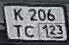
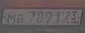

# License Plate Recognition Results

**Total images processed:** 2
**Total plates detected:** 4

---

## Image 1: [0a4cf1ab47d219cc61225f599a6427f9.jpg](data/examples/test/0a4cf1ab47d219cc61225f599a6427f9.jpg)

**Detected plates:** 2

| # | Plate Number | Region | Confidence |
|---|--------------|--------|------------|
| 1 | **K206TC123** | ru | 1.000 |
| 2 | **K206TC12** | ru | 0.991 |

---

## Image 2: [0a6c9609d3ecb0e24ad66296716d1412.jpg](data/examples/test/0a6c9609d3ecb0e24ad66296716d1412.jpg)

**Detected plates:** 2

| # | Plate Number | Region | Confidence |
|---|--------------|--------|------------|
| 1 | **MG7891** | eu | 0.992 |
| 2 | **779IX4** | by | 0.991 |

---
